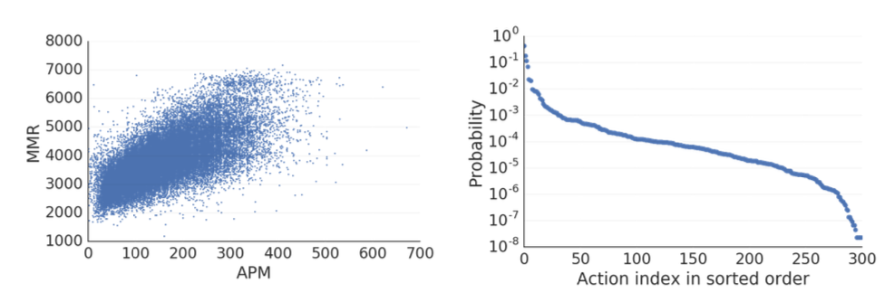
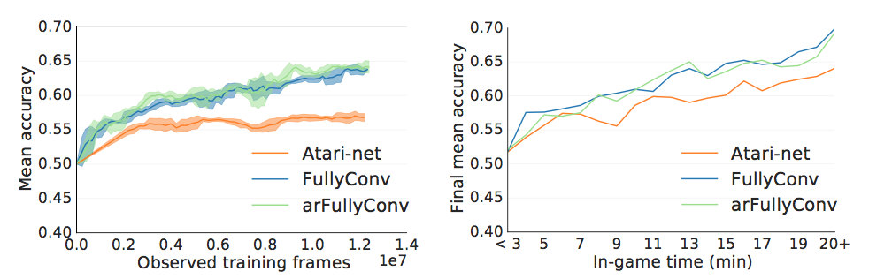

# 스타크래프트 II : 강화학습의 새로운 챌린지
### StarCraft II : New Challenge for Reinforcement Learning

#### DeepMind

Oriol Vinyals Timo Ewalds Sergey Bartunov Petko Georgiev
 Alexander Sasha Vezhnevets Michelle Yeo Alireza Makhzani John Agapiou Julian Schrittwieser Stephen Gaffney
Karen Simonyan Tom Schaul Hado van Hasselt David Silver

#### Blizzard

Heinrich Ku ̈ttler Stig Petersen
Timothy Lillicrap
Kevin Calderone Paul Keet Anthony Brunasso David Lawrence Anders Ekermo Jacob Repp Rodney Tsing

#### Abstract

이 글에서는 스타 크래프트 II 게임을 기반으로 한 강화 학습 환경 인 SC2LE (StarCraft II Learning Environment)을 소개합니다. 이 영역은 대부분의 이전 연구에서 고려 된 것보다 어려운 유형의 문제를 나타내는 강화 학습을위한 새로운 큰 도전 과제를 제시합니다. 여러 플레이어가 상호 작용하는 다중 에이전트 문제입니다. 부분적으로 관찰 된지도 때문에 불완전한 정보가 있습니다. 그것은 수백 개의 단위를 선택하고 통제하는 것과 관련된 커다란 행동 공간을 가지고있습니다. 원시 입력 특징 평면에서만 관찰되어야하는 큰 상태 공간을 가지고 있습니다. 수천 단계에 걸친 장기 전략을 필요로하는 신용 ​​할당이 지연되었습니다. 우리는 스타 크래프트 II 도메인에 대한 관찰, 행동 및 보상 사양을 설명하고 게임 엔진과 통신하기위한 오픈 소스 파이썬 기반 인터페이스를 제공합니다. 주요 게임지도 외에도 Star-Craft II 게임 플레이의 다양한 요소에 중점을 둔 미니 게임 모음을 제공합니다. 주요 게임 맵의 경우, 우리는 또한 인간 프로게이머의 게임 재생 데이터의 부속 데이터 세트를 제공합니다. 우리는이 데이터로부터 훈련 된 신경망에 대한 초기베이스 라인 결과를 제공하여 게임 결과 및 플레이어 행동을 예측합니다. 마지막으로, 스타 크래프트 II 도메인에 적용된 표준 심층 강화 학습 에이전트에 대한 초기 기준 결과를 제시합니다. 미니 게임에서이 에이전트는 초보자 플레이어와 비슷한 수준의 게임을하는 법을 배웁니다. 그러나 주 게임에서 훈련을 받으면 이들 에이전트는 상당한 진전을 이루지 못합니다. 따라서 SC2LE은 심층적 인 학습 알고리즘 및 아키텍처를 탐색하기위한 새롭고 도전적인 환경을 제공합니다.

#### 서론

최근 음성 인식 [7], 컴퓨터 비전 [15], 자연어 처리 [37]와 같은 영역에서의 진보는 강화 학습의 부활에 기인 할 수있습니다 [16]. 비선형 함수 근사를위한 강력한 툴킷을 제공합니다. 신경망. 이 기술은 또한 Atari [20], Go [31] 게임, 3 차원 가상 환경 [3] 및 시뮬레이션 된 로봇 영역 [17, 28]에서 중요한 성공을 가져 오는 강화 학습 문제에서 성공적으로 입증되었습니다. 이러한 성공의 상당 부분은 적절한 수준의 난이도를 가진 시뮬레이션 된 도메인의 가용성으로 인해 자극을 받았습니다. 벤치 마크는 심층 학습 및 강화 학습 (RL) 연구를 측정하고 발전시키는 데 중요합니다 [4, 20, 27, 8]. 따라서 하나 이상의 차원에서 현재 방법의 기능을 벗어나는 도메인의 가용성을 보장하는 것이 중요합니다.
이 글에서는 스타 크래프트 II 비디오 게임을 기반으로 강화 학습을위한 새롭고 도전적인 영역 인 SC2LE1 (스타 크래프트 II 학습 환경)을 소개합니다. 스타 크래프트는 빠르게 진행되는 마이크로 액션과 높은 수준의 계획 및 실행의 필요성을 결합한 실시간 전략 (RTS) 게임입니다. 지난 20 년 동안 스타 크래프트 Ⅰ과 Ⅱ는 전자 스포츠를 개척하고 지속해 왔으며, 2는 수백만의 평범하고 경쟁이 치열한 프로 선수들로 구성되었습니다. 따라서 최고의 인간 선수를 물리 치는 것은 의미 있고 측정 가능한 장기 목표가됩니다.
강화 학습 관점에서 볼 때, 스타 크래프트 II는 도전적인 새로운 국경을 탐험 할 수있는 독보적 인 기회를 제공합니다. 첫째, 여러 사람이 영향력과 자원을 놓고 경쟁하는 다중 에이전트 문제입니다. 또한 하위 레벨의 멀티 에이전트입니다. 각 플레이어는 공통 목표를 달성하기 위해 협력해야하는 수백 개의 유닛을 제어합니다. 둘째, 불완전한 정보 게임입니다. 지도는 지역 카메라를 통해 부분적으로 만 관측되며 플레이어는 정보를 통합하기 위해 적극적으로 이동해야합니다. 또한, "안개"가 있어 지도의 미개척 지역을 파악하고 상대방의 상태를 파악하기 위해 적극적으로 지도를 탐색해야합니다. 셋째, 행동 공간은 방대하고 다양합니다. 플레이어는 포인트 앤 클릭 인터페이스를 사용하여 약 108 개의 가능성있는 조합 공간 중에서 작업을 선택합니다. 고유 한 지역 조치가있는 여러 가지 단위 및 건물 유형이 있습니다. 또한 법적 조치는 플레이어가 가능한 기술 트리를 통해 진행함에 따라 다양합니다. 넷째, 게임은 일반적으로 수천 개의 프레임과 액션에 사용되며 플레이어는 게임의 나중 (플레이어 군대가 만나는 순간)까지는 볼 수없는 결과로 조기 결정 (예 : 구축 할 유닛과 같은)을해야합니다. 시간적 신용 할당 및 탐사에서 많은 과제를 야기합니다.

이 글에서는 스타 크래프트에서 RL을보다 직관적으로 만들기위한 인터페이스를 소개합니다. 관측과 행동은 저해상도 그리드로 정의됩니다. 보상은 내장 된 컴퓨터 상대에 대한 스타 크래프트 II 엔진의 점수를 기반으로합니다. 전체 게임 맵 외에도 몇 가지 간단한 미니 게임이 제공됩니다. 미래의 릴리스는 StarCraft II의 모든 도전 과제를위한 인터페이스를 확장 할 것입니다 : 관측과 행동은 RGB 픽셀을 노출시킬 것입니다; 에이전트는 멀티 플레이어 게임에서 최종 승패 결과에 따라 순위가 결정됩니다. 그리고 평가는 경쟁적인 인간 플레이에서 사용되는 전체 게임 맵으로 제한 될 것입니다.

또한 인간 플레이어가 기록한 게임 리플레이를 기반으로 대규모 데이터 세트를 제공하므로 사람들이 게임을 할 때 수백만 건의 리플레이가 발생합니다. 우리는 인터페이스와이 데이터 세트의 결합이 기존 및 새로운 RL 알고리즘뿐 아니라 인식, 메모리 및 관심, 시퀀스 예측 및 모델링 불확실성에 대한 흥미로운 측면을 테스트하는 데 유용한 벤치 마크를 제공 할 것이라고 믿습니다.이 모두가 활성 영역입니다 기계 학습 연구의
스타 크래프트 원본의 강화 학습을 위해 여러 환경 [1, 33, 32]이 이미 존재합니다. 우리의 작업은 여러 측면에서 이전 환경과 다릅니다 : 새로운 버전의 StarCraft II에 중점을 둡니다. 관찰 및 행동은 프로그래밍 방식이 아니라 인간 사용자 인터페이스를 기반으로합니다. Windows, Mac 및 Linux의 게임 개발자 인 Blizzard Entertainment가 직접 지원합니다.

내장 인공 지능이나 이전 환경에 대한 연구에 기반한 현재 최고의 인공 StarCraft 봇은 아마추어 선수들조차도 패배 할 수 있습니다 [cf. 6, 그리고 이후 버전의 AIIDE 경쟁]. 이 사실은 스타 크래프트의 흥미로운 게임 플레이 속성과 대규모 플레이어 기반과 결합되어 심층 강화 학습 알고리즘을 탐구하기위한 이상적인 연구 환경이되었습니다.

#### 관련 연구

컴퓨터 게임은 표준화 된 과제에 대한 다양한 학습 및 계획 접근 방법을 평가하고 비교하는 문제에 대한 강력한 솔루션을 제공하며 인공 지능 (AI) 연구의 중요한 원천입니다. 이 게임들은 여러 가지 이점을 제공합니다 : 1. 그들은 명확한 객관적 성공 척도를 가지고 있습니다. 2. 컴퓨터 게임은 일반적으로 깊은 네트워크에 이상적인 입력 인 풍부한 관찰 데이터 스트림을 출력합니다. 3. 그들은 인간이 플레이하기에는 어렵고 흥미 롭다고 외부 적으로 정의되어있습니다. 이렇게하면 연구자가 문제를 쉽게 해결할 수 있도록 과제 자체가 개발되는 알고리즘에 맞게 조정되지 않습니다. 4. 게임은 동일한 인터페이스와 게임 다이내믹을 통해 어디에서나 실행되도록 설계되어 다른 연구원과 정확하게 챌린지를 공유 할 수 있습니다. 5. 어떤 경우에는 열렬한 인간 선수들이 모여 있기 때문에 고도로 숙련 된 개인을 벤치마킹 할 수 있습니다. 6. 게임은 시뮬레이션이므로 정밀하게 제어하고 대규모로 실행할 수 있습니다.
강화 학습 연구를 주도하는 게임의 가장 좋은 예가 아타리 비디오 게임을 쉽고 반복적으로 실험 할 수있는 Arcade Learning Environment (ALE [4])입니다. 이 표준화 된 작업 세트는 AI에 대한 최근의 연구에 큰 도움이되었습니다. 이 환경에서 게임에 대한 점수는 간행물과 알고리즘 전반에서 비교할 수 있으므로 직접 측정하고 비교할 수 있습니다. ALE는 Super Mario [35], Pacman [26], Doom [13], Unreal Tournament [11] 등의 AI 게임에 대한 풍부한 벤치마킹의 장본인입니다. 비디오 게임 프레임 워크 [29, 5]와 경쟁 [23].
RTS 게임의 장르는 오리지널 스타 크래프트 (Broodwar)를 비롯하여 많은 AI 연구를 끌어 모았습니다. Ontanon et al. [21] 및 Robertson & Watson [25]에 대한 개요를 제공합니다. 이러한 연구 방향의 대부분은 게임의 특정 측면 (예 : 빌드 순서 또는 전투 마이크로 관리) 또는 특정 AI 기술 (예 : MCTS 계획)에 중점을 둡니다. 우리는 엔드 - 투 - 엔드 RL 접근법으로 풀 게임을 해결하려는 노력을 알지 못합니다. RTS 게임의 정식 버전을 다루는 것은 풍부한 입출력 공간과 매우 드문 보상 구조 (예 : 게임 결과)로 인해 어려웠습니다.
지금까지 StarCraft의 표준 API는 BWAPI 및 관련 래퍼였습니다 [32]. 인공 지능 연구를위한 간체 버전의 RTS 게임이 개발되었는데, 특히 microRTS3 또는 최신 ELF [34]가 그 중 하나입니다. 또한, 학습 기반 에이전트는 예를 들어 마이크로 관리 미니 게임 (예 : [22,36]) 또는 학습 게임 결과에서 탐색되거나 재생 데이터로부터 주문을 구축합니다 [9, 12].

### The SC2LE Environment

우리 논문의 주된 기여는 스타 크래프트 II를 연구 환경으로 드러내는 SC2LE의 발표입니다. 이 릴리스는 Linux StarCraft II 바이너리, StarCraft II API 및 PySC2의 세 가지 하위 구성 요소로 구성됩니다 (그림 1 참조).
스타 크래프트 II API4를 통해 스타 크래프트 II를 프로그래밍 방식으로 제어 할 수 있습니다. API는 게임을 시작하고, 관찰을하고, 행동을 취하고, 재연을 검토하는 데 사용할 수 있습니다. 일반 게임으로의이 API는 Windows 및 Mac OS에서 사용할 수 있지만 Linux에서 특히 머신 학습 및 분산 사용 사례를 위해 실행되는 제한없는 헤드리스 빌드도 제공합니다.
이 API를 사용하여 RL 에이전트에 최적화 된 오픈 소스 환경 인 PySC25를 구축했습니다. PySC2는 Python 강화 학습 에이전트와 StarCraft II 간의 상호 작용을 쉽게하기 위해 StarCraft II API를 래핑하는 Python 환경입니다. PySC2는 액션과 관찰 스펙을 정의하며, 예를 들어 무작위 에이전트와 스크립팅 된 에이전트를 포함합니다. 또한 에이전트가 볼 수 있고 수행 할 수있는 것을 이해하는 데 필요한 몇 가지 미니 게임과 과제 및 시각화 도구가 포함되어 있습니다.
스타 크래프트 II는 시뮬레이션 16 (초고속) 또는 초당 22.4 초 (초고속)를 업데이트합니다. 이 게임은 대부분 결정 론적이지만, 주로 미용상의 이유로 임의성이 있습니다. 두 가지 주요 무작위 요소는 무기 속도 및 업데이트 순서입니다. 이러한 임의성 소스는 임의 시드를 설정하여 제거 / 완화 할 수 있습니다.
이제이 백서의 모든 실험에 사용 된 환경을 설명합니다.

### Full Game Description and Reward Structure



스타 크래프트 II의 전체 1v1 게임에서 자원과 경사로, 병목 현상 및 섬과 같은 다른 요소가 포함 된지도에서 두 명의 상대가 산란합니다. 게임에서이기려면 플레이어는 1. 자원 (광물 및 베 스펜 가스)을 축적하고, 2. 생산 건물을 건설하고, 3. 군대를 쌓고, 4. 상대방 건물을 모두 없애야합니다. 일반적으로 게임은 몇 분에서 1 시간 정도 지속되며 게임에서 취한 조기 조치 (예 : 건물 및 유닛 제작)에는 장기적인 결과가 있습니다. 플레이어는 유닛이있는지도의 부분 만 볼 수 있기 때문에 불완전한 정보를 가지고 있습니다. 상대방의 전략을 이해하고 이에 대응하려면 스카우터에게 유닛을 보내야합니다. 이 섹션의 뒷부분에서 설명 하듯이 작업 공간 또한 매우 독특하고 까다로운 작업입니다.
대부분의 사람들은 다른 사람의 플레이어와 온라인으로 게임을합니다. 가장 일반적인 게임은 1 대 1이지만 팀 게임이 가능합니다 (2v2, 3v3 또는 4v4). 불균형 팀 또는 2 개 팀 이상으로 구성된 더 복잡한 게임도 마찬가지입니다. 여기서는 경쟁 스타 크래프트 중 가장 인기있는 형태 인 1v1 형식에 초점을 맞추지 만, 앞으로 더 복잡한 상황을 고려할 수 있습니다.
스타 크래프트 II에는 손으로 만든 규칙 세트를 기반으로하는 난이도가 10 가지 인 기본 제공 AI가 포함되어 있습니다.이 중 가장 강력한 세 가지 옵션은 추가 리소스 또는 특권이 부여 된 비전을 얻음으로써 속이는 것입니다. 불행하게도 스크립트 작성이라는 사실은 전략이 상당히 좁다는 것을 의미합니다. 따라서, 그들은 쉽게 악용 될 수 있는데, 이는 인간이 자신들의 관심을 상당히 빨리 잃는 경향이 있음을 의미합니다. 그럼에도 불구하고, 우리는 4 절과 5 절에서 조사한 기준선과 같이 순전히 학습 된 접근법에 대한 합리적인 첫 번째 도전 과제입니다. 그들은 무작위보다 훨씬 뛰어나고, 적은 계산량으로 매우 빠르게 플레이하며, 비교할 수있는 일관된 기준선을 제공합니다.
우리는 두 가지 보상 구조를 정의합니다 : 게임이 끝날 때받은 삼중 1 (승리) / 0 (묶음) / -1 (손실)과 블리자드 점수. 삼자 승 / 동점 / 손실 점수는 우리가 신경 쓰는 진정한 보상입니다. 블리자드 점수는 게임이 끝날 때 승부 차기에서 볼 수있는 점수입니다. 플레이어는 게임이 끝날 때만이 점수를 볼 수 있지만 점수 변경을 강화 학습에 대한 보상으로 사용할 수 있도록 게임 중 매 단계마다 실행중인 블리자드 점수에 액세스 할 수 있습니다. 그것은 현재의 자원과 조사 된 업그레이드의 합계뿐만 아니라 현재 살아 있고 지어지고있는 유닛과 건물들로 계산됩니다. 이것은 플레이어의 누적 보상이 더 많은 채굴 자원과 함께 증가하고, 유닛 / 건물을 잃을 때 감소하며, 모든 다른 액션 (훈련 유닛, 건물 및 조사)이 영향을 미치지 않는다는 것을 의미합니다. 블리자드 점수는 플레이어 중심이기 때문에 제로섬이 아니며 3 진 보상 신호보다 훨씬 적습니다. 또한 블리자드 점수는 승패와 어느 정도 관련이 있습니다.

### Observations

스타 크래프트 II는 3D로 그래픽을 렌더링하는 게임 엔진을 사용합니다. 스타 크래프트 II API는 현재 전체 환경을 시뮬 레이팅하는 기본 게임 엔진을 사용하면서 현재 RGB 픽셀을 렌더링하지 않습니다. 대신 StarCraft II의 핵심 공간 및 그래픽 개념 (그림 2 참조)을 유지하면서 인간 재생 중에 보이는 RGB 이미지를 추상화하는 일련의 "기능 레이어"를 생성합니다.

따라서 주요 관측치는 N × M 픽셀 (N과 M은 구성 가능하지만 우리 실험에서는 항상 N = M을 사용했지만)에서 렌더링되는 피쳐 레이어 세트로 제공됩니다. 각 레이어는 유닛 유형, 히트 포인트, 소유자 또는 가시성과 같이 게임에서 특정한 것을 나타냅니다. 이들 중 일부 (예 : 히트 포인트, 높이 맵)는 스칼라이며 다른 요소 (예 : 가시성, 단위 유형, 소유자)는 범주입니다. 기능 레이어에는 두 세트가 있습니다. 미니 맵은 전체 세계의 상태를 대략적으로 표현한 것이며 화면은 플레이어의 화면보기에 해당하는 세계 하위 섹션의 상세보기이며 대부분의 작업은 실행. 일부 기능 (예 : 소유자 또는 공개 설정)은 화면과 미니 맵에 모두 존재하지만 다른 유형 (예 : 단위 유형과 히트 포인트)은 화면에만 있습니다. 제공된 모든 관측치에 대한 전체 설명은 환경 문서 6을 참조하십시오.
화면과 미니 맵 이외에, 게임을위한 휴먼 인터페이스는 다양한 비 공간 관측을 제공합니다. 여기에는 수집 된 가스 및 광물의 양, 현재 이용할 수있는 일련의 작업 (어떤 단위가 선택되는지와 같은 게임 컨텍스트에 따라 다름), 선택한 유닛에 대한 세부 정보, 대기열 및 수송 차량의 유닛이 포함됩니다. 이러한 관찰은 PySC2에 의해 노출되며 환경 문서에 자세히 설명되어 있습니다.
전체 게임에서 화면은 고해상도에서 완전한 3D 원근감 카메라로 렌더링됩니다. 이것은 화면에서 "더 높게"작아지면서 단위가 점점 작아지고 정면보다 뒤쪽에 더 많은 세계 공간이 보이기 때문에 복잡한 관측을 유도합니다. 이를 단순화하기 위해 피쳐 레이어는 위에서 아래로의 직각 투영을 사용하는 카메라를 통해 렌더링됩니다. 즉, 피쳐 레이어의 각 픽셀은 정확히 동일한 양의 세계 부동산에 해당하므로 결과적으로 모든 단위는 뷰의 위치에 관계없이 같은 크기가됩니다. 불행히도, 이는 피쳐 레이어 렌더링이 인간이 보는 것과 전혀 일치하지 않는다는 것을 의미합니다. 에이전트는 앞면이 조금 더 뒤쪽이 조금 적게 보입니다. 이것은 인간이 리플레이에서 만드는 몇 가지 행동을 완전히 표현할 수 없다는 것을 의미합니다.
향후 버전에서는 에이전트가 RGB 픽셀에서 재생할 수있게 해주는 렌더링 된 API를 공개 할 것입니다. 이를 통해 미적 픽셀에서 배우는 것과 피쳐 레이어에서 학습하는 효과를 연구하고 인간 플레이와의 더 긴밀한 비교를 할 수 있습니다. 그 동안 우리는 에이전트가 중증 장애가 아닌지 확인하기 위해 기능 계층을 사용하여 게임을했습니다. 게임 플레이 경험이 분명히 변경되었지만, 우리는 N, M ≥ 64의 해상도가 플레이어가 저글링과 같은 작은 유닛을 선택하여 개별적으로 제어 할 수 있음을 알았습니다. 독자는 pysc2 play7을 사용하여 이것을 시도하는 것이 좋습니다. 그림 2를 참조하십시오.

### Actions

우리는 Atari [4]와 같은 다른 RL 환경에서 사용되는 규칙을 유지하면서 가능한 한 인간 인터페이스를 모방하는 환경 활동 공간을 설계했습니다. 그림 3은 플레이어와 에이전트가 생성 한 짧은 동작 시퀀스를 보여줍니다.
게임의 많은 기본적인 기동은 복합 행동입니다. 예를 들어지도에서 선택한 유닛을 이동하려면 플레이어가 먼저 m을 눌러 이동하도록 선택해야하며, Shift 키를 누른 상태에서 대기열을 선택하고 화면상의 한 점을 클릭하거나 해당 동작을 실행하려면 최소화를 선택해야합니다. 요원에게 3 가지 키 / 마우스 프레스를 3 가지 별도의 동작 순서로 생성하도록 요청하는 대신, 우리는 원자 화합물 기능 동작으로이를 제공합니다. 화면 이동 (대기 화면, 화면).
보다 공식적으로, 동작 a는 기능 식별자 a0의 구성과 그 기능 식별자가 요구하는 일련의 인수로 표현된다. a1, a2,. . . , aL. 예를 들어 사각형을 그려서 여러 단위를 선택하는 것이 좋습니다. 원하는 동작은 rect를 선택합니다 (add, (x1, y1), (x2, y2) 선택). 첫 번째 인수 select add는 바이너리입니다. 다른 인수는 좌표를 정의하는 정수입니다. 허용되는 범위는 관측치의 해상도와 같습니다. 이 동작은 [select rect, [[add add], [x1, y1], [x2, y2]]] 형식으로 환경에 제공됩니다. 전체 행동 공간을 표현하기 위해 우리는 13 가지 가능한 유형의 논증 (2 중에서 2 차원 스크린상의 점을 지정하는 것까지)을 가진 약 300 개의 행동 함수 식별자를 정의합니다. PySC2를 통해 사용할 수있는 동작에 대한 자세한 사양 및 설명은 환경 문서를 참조하십시오. 동작 시퀀스의 예는 그림 3을 참조하십시오.
스타 크래프트에서는 모든 게임 상태에서 모든 동작을 사용할 수있는 것은 아닙니다. 예를 들어 이동 명령은 유닛을 선택한 경우에만 사용할 수 있습니다. 휴먼 플레이어는 화면의 "명령 카드"에서 어떤 작업을 사용할 수 있는지 확인할 수 있습니다. 마찬가지로 우리는 각 단계에서 에이전트에게 주어진 관찰을 통해 사용 가능한 작업 목록을 제공합니다. 사용할 수없는 조치를 취하는 것은 오류로 간주되므로 에이전트은 법적 조치 만 취하도록 조치 옵션을 필터링해야합니다.
일반적으로 인간은 분당 30 ~ 300 회의 행동을하며, 플레이어의 숙련도에 따라 대체로 증가합니다. 프로패셔널 플레이어는 종종 500 APM 이상으로 증가합니다. 우리의 모든 RL 실험에서 우리는 중간 플레이어에게 합당한 선택 인 약 180 APM에 해당하는 8 게임 프레임마다 행동합니다.
우리는 이러한 초기 디자인 선택이 우리 환경을 복잡한 RL 에이전트 개발을위한 유망한 테스트 베드로 만든다고 믿습니다. 특히, 고정 크기 피쳐 레이어 입력 공간 및 휴먼 유사 동작 공간은 신경망 기반 에이전트에 대해 자연 스럽다. 이것은 게임이 유닛 단위로 접근되고 액션이 각 유닛에 개별적으로 지정되는 다른 최신 연구 [32, 22]와는 대조적입니다. 두 인터페이스 스타일 모두에 이점이 있지만 PySC2는 다음을 제공합니다.
• 인간의 재연에서 배우는 것이 더 간단 해집니다.
• 우리는 지침을 개별적으로 발표 할 때 분당 비현실적 / 초 인간적 행동을 요구하지 않습니다.
ually 각 단위
• 게임은이 UI로 실행되도록 고안되었으며 전략적 고수준 의사 결정, 경제 관리 및 군대 통제 사이의 균형은 게임을 더욱 흥미롭게 만듭니다.

### 3.4 Mini-Games Task Description

게임의 요소를 개별적으로 조사하고 전체 게임을 진행하기 위해 더 세부적인 단계를 제공하기 위해 몇 가지 미니 게임을 제작했습니다. 이것들은 명확한 보상 구조로 액션 및 / 또는 게임 매커니즘의 서브셋을 테스트하는 목적으로 구축 된 작은 맵에 초점을 맞춘 시나리오입니다. 보상이 단지 승 / 패 / 넥타이 인 전체 게임과 달리 미니 게임의 보상 구조는 특정 동작 (해당 .SC2Map 파일에 정의 된대로)을 보상 할 수 있습니다.

강력한 스타 크래프트 맵 편집기를 사용하여 커뮤니티가 수정 또는 새로운 미니 게임을 제작할 것을 권장합니다. 이를 통해 다양한 범위의 작은 챌린지 도메인을 설계하는 것 이상을 가능하게합니다. 다른 연구원과 동일한 설정 및 평가를 공유하고 직접 비교 가능한 평가 점수를 얻을 수 있습니다. 제한된 동작 세트, 맞춤 보상 기능 및 / 또는 시간 제한은 공유하기 쉬운 결과 .SC2Map 파일에 직접 정의됩니다. 따라서 사용자는 에이전트 측에서 사용자 정의하는 대신 새 작업을 정의하는이 방법을 사용하는 것이 좋습니다.
우리가 발표하는 7 개의 미니 게임은 다음과 같습니다.
MoveToBeacon : 에이전트는 하나의 마린을 가지고 있는데, 하나의 마린은 신호를받을 때마다 +1을 얻습니다. 이지도는 사소한 욕심쟁이 전략을 가진 단위 테스트입니다.
• CollectMineralShards : 에이전트는 두 명의 해병으로 시작하여지도 주위에 퍼져있는 무기 조각을 집기 위해 그들을 선택하고 이동해야합니다. 유닛을 효율적으로 움직이면 점수가 올라갑니다.
• FindAndDefeatZerglings : 에이전트는 3 마리의 해병으로 시작하여지도를 탐색하여 개별 저글링을 찾아 내야합니다. 이를 위해서는 카메라 이동과 효율적인 탐사가 필요합니다.
DefeatRoaches : 에이전트는 9 명의 해병으로 시작하여 4 개의 바퀴벌레를 물리쳐야합니다. 모든 바퀴벌레를 물리 칠 때마다 보병 5 명과 새로운 바퀴벌레 4 마리가 산란합니다. 보상은 바퀴벌레 당 +10, 해양 당 -1이 사망합니다. 더 많은 해병들이 살아남을수록 더 많은 바퀴벌레들이 패배 할 수 있습니다.
• DefeatJerglingsAndBanelings : 상대방이 Zerling과 Banelings을 가지고 있습니다는 것을 제외하고는 DefeatRoaches와 동일합니다. 죽을 때마다 +5의 보상을줍니다. 적 유닛의 능력이 다르므로 다른 전략이 필요합니다.
• CollectMineralsAndGas : 에이전트는 제한된 기반으로 시작하여 제한된 시간 내에 수집 된 총 리소스에 대해 보상을받습니다. 성공적인 에이전트은 더 많은 인력을 확보하고 자원 회수율을 높이기 위해 확장해야합니다.
• BuildMarines : 에이전트는 제한된 기지에서 시작하여 해병대 건설에 대한 보상을받습니다. 그것은 노동자를 만들고, 자원을 모으고, 공급 창고를 짓고, 막사를 만들고, 해병을 훈련해야합니다. 작업 공간은이 목표를 달성하는 데 필요한 최소 작업 집합으로 제한됩니다.
모든 미니 게임은 정해진 시간 제한이 있으며 자세한 내용은 온라인 (https : // github)을 참조하십시오. com / deepmind / pysc2 / blob / master / docs / mini_games.md에 있습니다.

### 3.5 Raw API

스타 크래프트 II에는 또한 원시 API가 있으며, 이는 Broodwar API (BWAPI [1])와 유사합니다. 이 경우 관측치는지도에 표시되는 모든 단위와 속성 (단위 유형, 소유자, 좌표, 건강 등)과 함께 표시되지만 시각적 요소는 없습니다. 안개는 여전히 존재하지만 카메라가 없으므로 보이는 모든 유닛을 동시에 볼 수 있습니다. 이것은보다 간단하고 정확한 표현이지만 인간이 게임을 인식하는 방식과 일치하지 않습니다. 인간과 비교하기 위해 이것은 중요한 추가 정보를 제공하기 때문에 "부정 행위"로 간주됩니다.
원시 API를 사용하여 액션은 유닛 식별자로 유닛 또는 유닛 그룹을 개별적으로 제어합니다. 행동을 취하기 전에 개인이나 단체를 선택할 필요가 없습니다. 이것은 휴먼 인터페이스가 허용하는 것보다 훨씬 더 정확한 동작을 허용하고, 따라서이 API를 통한 슈퍼 인간 행동의 가능성을 가져온다.
우리는 기계 학습 연구에 원시 API를 사용하지 않았지만 커뮤니티가 유용하다고 생각할 수있는 다른 유스 케이스 (예 : 스크립트 에이전트 및 시각화)를 지원하기 위해 릴리스의 일부로 포함되었습니다.

### Performance

우리는 종종 실시간보다 빠른 환경을 실행할 수 있습니다. 관측치는 몇 가지 요인, 즉 맵 복잡성, 화면 해상도, 작업 당 렌더링되지 않은 프레임 수 및 스레드 수에 따라 달라지는 속도로 렌더링됩니다.
복잡한지도 (예 : 전체 사다리지도)의 경우 계산 속도가 시뮬레이션 속도에 의해 결정됩니다. 동작 빈도를 줄이고 렌더링 프레임을 줄이면 계산이 줄어들지 만 반환 킥은 상당히 줄어들어 작업 당 8 단계 이상의 이득은 거의 없습니다. 적은 시간을 주면 더 높은 해상도로 렌더링해도 문제가되지 않습니다. 병렬 스레드에서 더 많은 인스턴스를 실행하면 확장이 잘됩니다.
보다 단순한지도 (예 : CollectMineralShards)의 경우 세계 시뮬레이션이 매우 빠르기 때문에 관측치가 지배적입니다. 이 경우 작업 당 프레임 수를 늘리고 해상도를 낮추면 큰 효과를 얻을 수 있습니다. 그런 다음 병목 현상이 파이썬 인터프리터가되어 하나의 인터프리터로 약 4 개 이상의 스레드를 얻지 못합니다.
64 x 64 해상도로 동작 당 8 프레임의 속도로 작동하는 래더 맵의 단일 스레드 속도는 벽 시계 초당 200-700 게임 단계에서 다양합니다. 실시간. 정확한 속도는 게임의 무대, 플레이중인 유닛의 수 및 게임이 실행되는 컴퓨터 등 여러 요소에 따라 달라집니다. CollectMineralShards에서 같은 설정은 벽시계마다 1600-2000 게임 단계를 허용합니다.

## Reinforcement Learning: Baseline Agents

이 섹션에서는지도 난이도를 보정하는 데 도움이되는 몇 가지 기본 결과를 제공하며, 설정된 RL 알고리즘이 최소한 미니 게임에서는 유용한 정책을 학습 할 수있을뿐만 아니라 많은 과제가 남아 있음을 보여줍니다. DeepMind 게임 테스터 (초보자 수준)와 StarCraft GrandMaster (전문가 수준) (표 1 참조)의 두 사람이 점수를 추가로 제공합니다.

### 4.1 Learning algorithm

강화 학습 에이전트의 핵심에는 정책 $$π_θ$$를 정의하는 매개 변수 θ가있는 심층 신경망이 있습니다. 시간 단계 t에서 에이전트는 관측치 $$s_t$$를 수신하고 확률 $$π_θ (a_t | s_t)$$로 동작을 선택한 다음 환경으로부터 보상 $$r_t$$를받습니다. 에이전트의 목표는 $$G_t = \sum^\infty_{k = 0} γ^kr_{t + k + 1}$$의 반환 값을 최대화하는 것입니다. 여기서 γ는 할인 계수입니다. 표기법상의 명확성을 위해, 정책은 관측치에서만 조건부로 가정되지만, 일반성의 손실없이, 예를 들어, 우리가 이하에서 설명하는 바와 같이 은폐 된 메모리 상태를 통해 모든 이전 상태에 조건을 부여 할 수도있습니다.
정책의 매개 변수는 Mnih 등이 설명한 Asynchronous Advantage Actor Critic (A3C)을 사용하여 학습합니다. [19], 이는 다양한 환경에서 최첨단 결과를 산출하는 것으로 나타났습니다. 이것은 정책 기울기 방법이며 E [Gt]에 대한 대략적인 그래디언트 상승을 수행합니다. A3C 그라디언트는 다음과 같이 정의됩니다.
여기서 vθ (s)는 동일한 네트워크에서 생성 된 예상 수익 E [Gt | st = s]의 가치 함수 추정치입니다. 전체 반환 대신에 위의 그래디언트에서 n 단계 반환 Gt = nk = 0 γkrt + k + 1 + γnvθ (st + n)를 사용할 수 있습니다. 여기서 n은 하이퍼 매개 변수입니다. 마지막 용어는 탐험을 촉진하는 더 큰 엔트로피에 대한 정책을 규범화하고, β와 η는 다른 손실 성분의 중요성을 상쇄시키는 하이퍼 파라미터입니다. 더 자세한 내용을 원하면 독자들에게 원 논문 [19]과 거기에 나오는 참고 문헌을 참조하십시오.

### 4.2 Policy representation

3 절에서 설명한 것처럼 API는 동작을 함수 식별자 a0과 인수 집합을 포함하는 중첩 목록으로 노출합니다. 스크린과 미니 맵의 픽셀 좌표를 포함한 모든 인수는 이산 적이기 때문에 정책 π (a | s)의 순진한 매개 변수화는 공간 해상도가 낮을 때조차도 수십억 개의 값을 필요로합니다. 대신, 우리는 연쇄 규칙을 활용하여 자동 회귀 적 방식으로 정책을 표현할 것을 제안합니다.

이 표현은 효율적으로 구현된다면, 전체 행동을 선택하는 문제를 각 인수에 대한 일련의 결정으로 변환함에 따라 틀림없이 더 간단하다. 함수 식별자 a0에 따라 필요한 인수 L의 개수가 다릅니다. 일부 동작 (예 : no-op 동작)은 인수를 필요로하지 않지만 다른 동작 (예 : 화면 이동 (x, y))은 수행합니다. 이 변동성을 나타내는 일련의 짧은 조치의 예는 그림 3을 참조하십시오.
인수에 대해 임의의 순열을 사용하여 체인 규칙이 적용되는 순서를 정의 할 수 있습니다. 그러나 화면에서 클릭하는 위치에 대한 결정은 자연스럽게 클릭의 목적, 즉 호출되는 함수의 식별자에 따라 달라집니다. 대부분의 실험에서 우리는 하위 작업을 독립적으로 모델링하는 것으로 충분하다는 것을 알았지 만 우리는 함수 식별자를 먼저 결정한 다음 모든 범주 형 인수를 결정하고 관련이 있습니다면 최종적으로 순서가 선택되는 자동 회귀 정책을 탐구했습니다 , 픽셀 좌표.
우리 에이전트가 사용할 수없는 동작을 결코 사용하지 못하게하기 위해 a0의 함수 식별자 선택을 마스크하여 적절한 부분 집합 만 샘플링 할 수 있습니다. 플레이어가 UI에서 버튼을 임의로 클릭하는 방법을 모방합니다. 우리는 액션을 마스킹하고 a0에 대한 확률 분포를 재 정규화하여이를 구현합니다.

### 4.3 Agent Architectures

이 절에서는 합리적인 기준선을 생성 할 목적으로 여러 에이전트 아키텍처를 제시합니다. 우리는 문헌 [20, 19]에서 확립 된 아키텍쳐를 취해 환경, 특히 행동 공간의 특성에 맞도록 적응시킨다. 그림 4는 제안 된 아키텍처를 보여줍니다.
입력 전처리 모든 기본 에이전트은 동일한 입력 기능 레이어 사전 처리를 공유합니다. 범주 형 값을 포함하는 모든 피쳐 레이어를 연속 공간에 포함합니다. 이는 채널 차원에서 1 핫 인코딩을 사용하고 1x1 컨벌루션을 사용하는 것과 같습니다. 또한 히트 포인트 나 미네랄과 같은 일부가 대단히 높은 값을 갖기 때문에 대수 변환으로 숫자 기능을 다시 스케일합니다.
Atari-net Agent 첫 번째 기준은 Atari [4] 벤치 마크 및 DeepMind Lab 환경 [3]에서 성공적으로 사용 된 아키텍처의 밀접한 적응입니다. 그것은 [19]에서와 같이 동일한 컨볼 루션 네트워크를 사용하여 화면 및 미니 맵 피처 레이어를 처리합니다. 크기가 각각 8, 4 및 스트라이드 4, 2 인 16, 32 필터가있는 두 레이어. 비 공간적 특징 벡터는 tanh 비선형 성을 갖는 선형 층에 의해 처리된다. 결과는 연결되어 ReLU 활성화가있는 선형 계층을 통해 전송됩니다. 마지막으로 결과 벡터는 선형 함수에 대한 정책을 출력하는 선형 레이어에 대한 입력으로 사용되며 각 함수 함수 인수 {al} Ll = 0은 독립적으로 사용됩니다.

FullyConv Agent 강화 학습을위한 컨볼 루션 네트워크 (예 : 위의 Atari-net베이스 라인)는 일반적으로 각 레이어에서 입력의 공간 해상도를 줄이고 궁극적으로 완전히 삭제 한 완전히 연결된 레이어로 마무리합니다. 이를 통해 공간 정보를 추출한 후 조치를 유추 할 수 있습니다. 스타 크래프트에서 중요한 도전 과제는 공간 동작을 추론하는 것입니다 (화면 및 미니 맵 클릭). 이러한 공간 작용이 입력과 동일한 공간 내에서 작용하기 때문에 입력의 공간 구조를 버리는 것이 바람직하지 않을 수 있습니다.
여기서 우리는 완벽한 컨 벌루 셔널 네트워크 에이전트를 제안합니다. 이것은 해상도 보존 컨볼 루션 레이어의 시퀀스를 통해 공간 동작을 직접 예측합니다. 우리가 제안하는 네트워크는 보폭이없고 모든 레이어에서 패딩을 사용하므로 입력에서 공간 정보의 해상도를 보존합니다. 간단히하기 위해 화면과 미니 맵 입력이 동일한 해상도를 가진다고 가정합니다. 우리는 크기가 각각 5 x 5, 3 x 3 인 16, 32 개의 필터를 사용하여 별도의 2 계층 컨벌루션 네트워크를 통해 화면 및 미니 맵 관찰을 전달합니다. 상태 표현은 채널 차원을 따라 방송 벡터 통계뿐만 아니라 화면 및 미니 맵 네트워크 출력의 연결에 의해 형성됩니다. 범주화 된 (비 공간적) 동작에 대한 기준 및 정책을 계산하기 위해 상태 표현은 먼저 256 단위 및 ReLU 활성화가있는 완전 연결된 계층을 통과 한 후 완전 연결된 선형 계층이 이어집니다. 마지막으로, 공간 동작에 대한 정책은 단일 출력 채널로 상태 표현을 1 × 1 컨볼 루션 (convolution)하여 얻습니다. 이 계산의 시각적 표현은 그림 4를 참조하십시오.
FullyConv LSTM Agent 위의 기준선은 모두 피드 포워드 (feed-forward) 아키텍처이므로 메모리가 없습니다. 이것이 일부 작업에는 충분하지만 우리는 StarCraft의 모든 복잡성에 충분할 것으로 기대할 수는 없습니다. 여기서 우리는 컨벌루션 LSTM에 기반한베이스 라인 아키텍처를 소개합니다. 위에서 설명한 완전 컨볼 루션 에이전트의 파이프 라인을 따르고 미니 맵과 화면 기능 채널을 비 공간 기능과 연결 한 후에 컨볼 루션 LSTM 모듈을 추가하기 만하면됩니다.
랜덤 에이전트 두 개의 임의의베이스 라인을 사용합니다. 무작위 정책은 모든 유효한 행동 중에서 무작위로 무작위로 선택하는 에이전트로, 매우 큰 행동 공간에서 성공 에피소드가 걸리는 것을 어렵게합니다. 무작위 검색 기준선은 무작위로 초기화 된 많은 정책 네트워크 (거의 확정적인 행동을 유도하는 낮은 softmax 온도)를 취하여 각 20 개의 에피소드를 평가하고 가장 높은 평균 점수를 유지함으로써 작동합니다. 액션 공간이 아닌 정책 공간에서 샘플링합니다는 점에서 보완 적입니다.

### 4.4 Results

A3C에서는 네트워크의 K = 40 포워드 스텝 이후 또는 터미널 신호가 수신되면 궤도를 자르고 역 전파를 실행합니다. 최적화 프로세스는 공유 RMSProp을 사용하여 64 개의 비동기 스레드를 실행합니다. 각 방법마다 무작위로 샘플링 된 하이퍼 매개 변수를 사용하여 100 회의 실험을 실행했습니다. 학습 속도는 양식 (10-5,10-3) 간격에서 샘플링했습니다. 학습 속도는 샘플링 된 값에서 모든 에이전트에 대한 초기 속도의 절반으로 선형 적으로 어닐링되었습니다. 우리는 행동 함수와 각 행동 함수 인자에 대해 독립적 인 엔트로피 페널티 10-3을 사용합니다. 우리는 매 8 게임 단계마다 정해진 속도로 행동하는데, 이것은 초당 약 세 번의 행동이나 180 APM에 해당합니다.

### 4.4.1 Full Game

풀 게임에 대한 실험을 위해 우리는 전문 온라인 경기 에서뿐만 아니라 순위가 매겨진 온라인 게임에서 사용 된 심연 리프 리프 (Abyssal Reef LE) 사다리 맵을 선택했습니다. 이 에이전트는 Terran 대 Terran의 대결에서 가장 쉬운 내장형 인공 지능과 대결을 펼쳤습니다. 최대 게임 길이는 30 분으로 설정되고 이후에 동점이 선언되고 에피소드가 종료됩니다.
실험 결과는 그림 5에 나와 있습니다. 놀랍게도 3 자 보상으로 훈련 된 요원 중 누구도 전체 게임을 실행할 수있는 전략을 개발할 수 없습니다. 메모리가없는 컨볼 루션 아키텍처를 기반으로 한 가장 성공적인 에이전트는 테란 (Terran)의 공격 범위를 벗어나 건물을 들어 올려서 이동시켜 일정한 손실을 피할 수있었습니다.
블리자드 점수로 훈련 된 요원은 광산 광물에서 작업자 유닛을 산만하게하는 것을 피하는 사소한 전략으로 수렴하여 점수의 안정적인 개선을 유지했습니다. 따라서 대부분의 에이전트의 점수는 단위 나 구조를 추가로 만들지 않고 초기 마이닝 프로세스를 보존하는 데 집중되었습니다 (이 동작은 아래 제안 된 미니 게임에서도 관찰되었습니다).
이러한 결과는 스타 크래프트 II의 전체 게임이 흥미롭고 도전적인 RL 도메인이며, 특히 인간 재생과 같은 다른 정보 소스를 활용하지 않을 때 유용하다는 것을 보여줍니다.

### 4.4.2 Mini-Games

섹션 3에서 설명한 것처럼 게임의 특정 측면에 초점을 둔 일련의 미니 게임을 정의하여 전체 게임의 복잡성을 피할 수 있습니다 (각 미니 게임에 대한 자세한 설명은 섹션 3 참조).
우리는 각 미니 게임에서 에이전트를 교육 시켰습니다. 수집 된 교육 결과는 그림 6에 나와 있으며 인간 기준선과 비교 한 최종 결과는 표 1에 나와 있습니다. 에이전트를 보여주는 비디오는 https://youtu.be/6L448yg0Sm0에서도 볼 수 있습니다.
전반적으로, 완전히 길쌈 에이전트는 사람이 아닌 기준선에서 가장 잘 수행했습니다. 다소 놀랍게도, Atari-net 에이전트는 FindAndDefeatZerlings, DefeatRoaches 및 DefeatZerlingsAndBanelings와 같은 미니 게임에 대해 상당히 강력한 경쟁자였습니다. CollectMineralsAndGas에서 최상의 컨볼 루션 에이전트 만 더 많은 작업자 유닛을 생성하고이를 광업에 할당하여 초기 자원 수입을 늘리는 방법을 배웠습니다.
우리는 BuildMarines가 가장 전략적으로 요구되는 미니 게임이고 아마도 StarCraft의 모든 게임에 가장 근접한 것으로 나타났습니다. 이 게임에서 가장 좋은 결과는 FullyConv LSTM과 Random Search에서 달성되었지만 Atari-Net은 각 에피소드마다 지속적으로 해병대를 생산하는 전략을 배우지 못했습니다. 이지도에 의해 부과 된 행동 공간에 대한 제한없이,이 미니 게임을 배우는 것은 사실 훨씬 더 어려울 것입니다.
GrandMaster 플레이어와 비교했을 때 모든 에이전트가 최적의 역학과 반응을 필요로하는 가장 단순한 MoveToBeacon을 제외하고 - 어떤 인공 에이전트가 잘 작동 할 것으로 예상됩니까? 그러나 DefeatRoaches 및 FindAndDefeatZerling과 같은 일부 게임에서는 대리점이 DeepMind 게임 테스터와 비교하여 잘 수행되었습니다.
우리의베이스 라인 에이전트의 결과는 비교적 단순한 미니 게임조차도 새로운 연구에 영감을 불어 넣기를 희망하는 흥미를 유발합니다는 것을 보여줍니다.

## 5 Supervised Learning from Replays

게임 리플레이는 전문가 및 아마추어 플레이어 모두가 사용하는 중요한 리소스입니다. 새로운 전략을 배우거나 게임에서 발생하는 중요한 실수를 찾거나 단순히 다른 사람들이 엔터테인먼트의 형태로 게임하는 것을 즐기는 것이 좋습니다. Replays는 숨겨진 정보 때문에 StarCraft에서 특히 중요합니다. "안개"는 상대방 유닛을 숨기지 않는 한 모든 것을 숨 깁니다. 따라서 전문 선수들 사이에서 그들이이기는 경우에도 그들이하는 모든 게임을 검토하고 분석하는 것이 표준 관행입니다.
리플레이 또는 인간 시위와 같은 감독 된 데이터의 사용은 로봇 [2, 24], Go [18, 31] 및 Atari [10] 게임에서 성공적이었습니다. 또한 StarCraft I (예 : [12])의 맥락에서 사용되었지만 기본 동작에 대한 정책을 교육하지는 않지만 빌드 오더를 발견하는 데 사용되었습니다.

스타 크래프트 II는 크고 성장하는 휴먼 리플레이 세트를 수집하고 배울 수있는 기회를 제공합니다. 스타 크래프트 1의 리플레이를 수집하기위한 중앙 및 표준화 된 메커니즘이 없었지만 수많은 익명화 된 스타 크래프트 II 게임을 블리자드의 온라인 1v1 사다리를 통해 쉽게 이용할 수 있습니다. 뿐만 아니라 상대적으로 안정적인 플레이어 풀이 새로운 게임을하기 때문에 더 많은 게임이이 세트에 정기적으로 추가됩니다.
리플레이에서 배우는 것은 강화 학습에 도움이 될 것입니다. 분리에서, 이는 장기 상관 관계를 다루는 시퀀스 모델링 또는 메모리 아키텍처의 벤치 마크로도 작용할 수 있습니다. 실제로 전개되는 게임을 이해하려면 많은 시간 단계에 걸쳐 정보를 효율적으로 통합해야합니다. 또한, 부분 관측 가능성으로 인해, 재연은 불확실성의 모델을 연구하는 데에도 사용될 수 있습니다 (그러나 이에 국한되지 않음). 변이 자동 부호화기 [14]. 마지막으로, 결과 / 행동 예측에 대한 성능을 비교하면 도메인에서 RL에 적합한 유도 성 바이어스를 갖는 신경 구조의 설계를 안내하는 데 도움이 될 수 있습니다.
이 절의 나머지 부분에서는 4 장에서 설명한 아키텍처를 사용하여베이스 라인을 제공하지만, 800K 게임 세트를 사용하여 가치 기능 (게임 관찰에서 게임의 승자를 예측)과 정책 (즉, , 게임 관측에서 취한 행동을 예측). 게임은 스타 크래프트 II에서 모든 가능한 매치업을 포함합니다 (즉, 에이전트가 단일 경주를하도록 제한하지 않습니다).

그림 7은 우리가 사용한 리플레이의 통계를 보여줍니다. 가장 흥미로운 통계를 요약하면 다음과 같습니다. 1. MMR (Matching Rating)에 의해 측정 된 플레이어의 기술 수준은 일반 게이머, 고급 아마추어, 전문가에 이르기까지 다양합니다. 2. 분당 평균 액션 횟수 (APM)는 153이며, 평균 MMR은 3789입니다. 3. 리플레이는 필터링되지 않으며 대신 BattleNet에서 플레이되는 모든 '순위'리그 게임이 사용됩니다 84. 1 % 미만은 마스터입니다 최고 수준의 리플레이. 5. 우리는 또한 인간 선수에 의한 사용 빈도에 따라 행동의 분포를 보여준다. 시간의 43 %를 차지하는 가장 빈번한 행동은 카메라를 움직이는 것입니다. 전반적으로, 동작 분포는 흔히 사용되는 몇 가지 동작 (예 : 카메라 이동, 사각형 선택, 공격 화면)과 드물게 사용되는 많은 수의 동작 (예 : 엔지니어링 베이 제작)이있는 무거운 꼬리가 있습니다.
우리는 게임 결과 (1 = 승리 대 0 = 손실 또는 동점)와 각 시간 단계에서 플레이어가 취한 행동을 예측하는 양방향 네트워크를 훈련합니다. 네트워크의 본문을 공유하면 두 가지 손실 함수에 대한 가중치의 균형을 유지해야하지만 가치 및 정책 예측을 통해 서로에게 알릴 수도 있습니다. 우리는 감독 된 훈련 설정에서 별도의 게임 결과 클래스를 만들지 않았습니다. 왜냐하면 데이터 세트의 수는 승리와 패배에 비해 매우 낮기 때문입니다 (1 % 미만).

## 5.1 Value Predictions

게임의 결과를 예측하는 것은 어려운 작업입니다. 전문 스타 크래프트 II 해설가조차도 게임 상태에 대한 완전한 액세스 (즉, 부분적인 관찰 가능성에 제한되지 않음)에도 불구하고 승자를 예측하지 못하는 경우가 있습니다. 게임 성과를 정확하게 예측하는 가치 함수는 희소 한 보상으로 학습의 어려움을 완화하는 데 사용할 수 있기 때문에 바람직합니다. 주어진 상태에서 잘 훈련 된 가치 함수는 게임 결과를보기 전에 오랫동안 움직일 가치가있는 이웃 국가를 제안 할 수 있습니다.
감독 학습을위한 설정은 4 절 : Atari-net 및 FullyConv에서 설명한 간단한 기본 아키텍처로 시작됩니다.

네트워크는 이전의 관측을 고려하지 않는다. 즉, 단일 프레임으로부터 결과를 예측합니다 (이것은 분명히 차선 이하 임). 또한 관측에는 특권 정보가 포함되지 않습니다. 에이전트은 주어진 시간 단계 (예 : 안개가 가능)에서 볼 수있는 것만을 기준으로 가치 예측을 산출해야합니다. 따라서 상대방이 에이전트가 만든 군대에 대해 매우 효과적인 많은 유닛을 비밀리에 만들어 냈다면 실수로 자신의 위치가 강하다고 믿을 수 있습니다. 4 절에서 제안 된 네트워크는 액션 식별자와 그 독립 변수를 독립적으로 생성합니다. 그러나, 스크린 상에 포인트를 예측하는 정확성은베이스 액션 (base action)을 컨디셔닝함으로써 개선 될 수있습니다 (예를 들어, 추가베이스를 구축하는 것 대 군대를 이동시키는 것). 따라서 Atari-net과 FullyConv 아키텍처 외에도 4.2 절에서 소개 한 자동 회귀 정책 소개를 사용하는 arFullyConv가 있습니다. 즉 함수 식별자 a0과 이전 인수 a <l을 사용하여 현재 인수에 대한 정책을 모델링합니다 al.
네트워크는 스타 크래프트 II에서 가능한 모든 매치업에 대한 200k 단계의 그래디언트 디센트에 대해 교육을 받았습니다. 우리는 시간 경과에 따라 모든 재생에서 무작위로 취한 64 회의 관측 미니 배치 (mini-batch)로 훈련했습니다. 관측치는 8 단계의 승수로 샘플링되며 RL 설정과 일치합니다. 화면과 미니 맵의 해상도는 64 × 64입니다. 각 관측치는 스크린과 미니 맵 공간적 특징 레이어와 플레이어의 통계 (음식 뚜껑과 인간의 플레이어가 화면에서 볼 수있는 수집 된 미네랄 수)로 구성됩니다. 우리는 90 재생 세트의 비율 (%), 그리고 나머지 10 %의 재생에서 가져온 0.5M 프레임의 고정 테스트 세트로 구성됩니다. 에이전트 성능은 교육이 진행됨에 따라이 테스트 세트에 대해 지속적으로 평가됩니다.
그림 8은 훈련 단계의 평균 정확도와 훈련 된 모델의 정확도를 게임 시간의 함수로 나타낸 것입니다. 랜덤베이스 라인은 게임이 모든 레이스 페어에서 균형을 잘 유지하기 때문에 약 50 %의 시간을 수정하며 매는 것은 극히 드뭅니다. 교육이 진행됨에 따라 FullyConv 아키텍처는 64 %의 정확도를 달성합니다. 또한 그림 8 (오른쪽)에서 볼 수 있듯이 게임이 진행됨에 따라 가치 예측이 더욱 정확 해집니다. 이것은 StarCraft I [9]에 대한 이전 연구 결과를 반영합니다.

### 5.2 Policy Predictions

값을 예측하도록 훈련 된 동일한 네트워크는 사용자가 발급 한 동작을 예측하도록 설계된 별도의 출력을가집니다. 우리는 게임을하기 위해 쉽게 배치 될 수 있기 때문에 네트워크의이 부분을 정책이라고 부르기도합니다.
재연에서 인간 행동을 모방하기 위해 네트워크를 훈련시키는 데 사용할 수있는 많은 계획이 있습니다. 여기서 우리는 4 절의 RL 작업과 직접적으로 연결되는 간단한 접근법을 사용합니다.

우리 정책을 수립 할 때 우리는 8 프레임의 고정 된 스텝 승수로 관측을 샘플링했습니다. 우리는 정책의 학습 목표로 각 8 프레임 내에서 발급 된 첫 번째 행동을 취합니다. 해당 기간 동안 아무런 조치도 취하지 않으면 목표를 '무효'로 간주합니다. 즉 효과가없는 특별한 조치입니다.
인간이 스타 크래프트 II를 사용하면 주어진 시간에 모든 가능한 동작의 하위 집합 만 사용할 수 있습니다. 예를 들어, "마린 건설"은 병영이 현재 선택된 경우에만 가능합니다. 네트워크는 불법 행위를 피하기 위해 배울 필요가 없습니다. 왜냐하면이 정보는 즉시 이용 가능하기 때문입니다. 따라서 훈련 중에는 인간 플레이어가 사용할 수없는 동작을 필터링합니다. 그렇게하기 위해, 우리는 지난 8 프레임 동안 이용 가능한 모든 액션의 조합을 취하고, 사용할 수없는 액션의 확률을 거의 0으로 설정하는 마스크를 적용합니다.
앞서 언급했듯이 우리는 모든 가능한 매치업을하도록 정책을 훈련 시켰습니다. 따라서 원칙적으로 에이전트는 모든 인종을 플레이 할 수 있습니다. 그러나 4 장에서 연구 된 강화 학습 에이전트와의 일관성을 위해, 우리는 테란 대 테란 매치업에서 게임 내 측정 기준을보고합니다.
표 2는 동작 식별자, 화면 및 미니 맵 인수를 예측할 때 정확도 측면에서 다른 아키텍처가 어떻게 수행되는지 보여줍니다. 예상대로, FullyConv 및 arFullyConv 아키텍처 모두 공간적 인수에 대해 더 나은 성능을 발휘합니다. 또한 arFullyConv 아키텍처는 FullyConv를 능가합니다. 아마도 인수가 사용될 동작 식별자를 알고 있기 때문입니다.
감독 학습을 통해 교육 된 정책을 게임에 직접 연결하면 그림 9와 https://youtu.be/의 비디오와 같이 관찰 된 재생 데이터의 함수로 더 많은 단위를 생성하고 더 잘 재생할 수 있습니다. WEOzide5XFc. 또한 감독 정책이 제한없는 전체 1v1 게임을하고 있음에도 불구하고 제한된 행동 공간을 가진 BuildMarines의 간단한 미니 게임에서 섹션 4에서 훈련 된 모든 에이전트보다 우수한 성능을 보입니다. 이 결과는 감독 된 모방 학습이 스타 크래프트 II 에이전트를 부트 스트래핑하는 데 유망한 방향이라고 제안합니다. 미래의 작업은 우리가 정말로 신경 쓰는 목표 즉 게임 결과에 대한 강화 학습을 직접 훈련함으로써 모방 초기화 정책을 향상시켜야합니다.

### 6 Conclusions & Future Work

이 글에서는 강화 학습 학습을위한 새로운 도전 과제로 스타 크래프트 II를 소개합니다. 블리자드의 공식 BattleNet 사다리를 통해 수집 된 순위가 매겨진 게임의 인간 재생 데이터뿐만 아니라 게임을하기 위해 자유롭게 사용할 수있는 Python 인터페이스에 대한 세부 정보를 제공합니다. 이 초기 버전에서는 정책 및 가치 네트워크에 대한 인간 재생 데이터에 대한 감독 학습 결과를 설명합니다. 우리는 또한 7 개의 미니 게임과 풀 게임에서 간단한베이스 라인 RL 에이전트에 대한 결과를 설명합니다.
우리는 미니 게임을 주로 단위 테스트로 간주합니다. 즉, RL 에이전트는 전체 게임에서 성공할 수있는 기회를 가지려면 비교적 쉽게 인간 수준 성능을 달성 할 수 있어야합니다. 추가 미니 게임을 제작하는 것은 도움이 될 수 있지만, 최종 결과에 대해 평가 한 전체 게임을 가장 흥미로운 문제로 삼고, 가장 먼저 그 솔루션으로 이어질 연구를 장려하기를 바랍니다.
일부 미니 게임의 성능은 전문 인간의 플레이와 비슷하지만 예상대로 현재 최첨단베이스 라인 에이전트가 전체 게임에서 가장 쉽게 내장 된 인공 지능을 상대로 승리하는 법을 배울 수 없습니다. 이는 게임 결과 (즉, -1, 0, 1)가 보상 신호로서 사용될 때뿐만 아니라, 각 타임 스텝 (즉, 블리자드에 의해 제공되는 네이티브 게임 스코어)에서 형상 보상이 제공되는 경우에도 마찬가지입니다. 이러한 의미에서 우리가 제공하는 환경은 즉시 정형화 된, 외부에서 정의 된, 그리고 기성의베이스 라인 알고리즘에 대해 완전히 다루기 어려운 과제를 제시합니다.
이 릴리즈는 인간이하는 것처럼 게임의 여러 측면을 단순화합니다. 1. 관측치가 에이전트에 주어지기 전에 사전 처리됩니다. 2. 키보드 대신 RL 에이전트가 작업 공간을 더 쉽게 사용할 수 있도록 단순화되었습니다. 인간이 사용하는 마우스 클릭 설정, 3. 잠금 단계에서 실행되므로 에이전트은 실시간이 아닌 각 시간 단계에서 필요한만큼 계산할 수 있습니다. 4. 전체 게임 만 재생할 수 있습니다 내장 인공 지능 그러나 우리는 RGB 픽셀 관측과 엄격한 시간 제한을 사용하여 자신의 영역에서 최고의 인간 플레이어를 수행 할 수있는 에이전트를 만드는 것이 현실적인 과제라고 생각합니다. 따라서 향후 릴리스에서는 위의 단순화를 완화하고 셀프 플레이를 활성화하여 인간이 공정한 상대로 간주하는 에이전트 교육의 목표를 향해 나아갈 수 있습니다.

